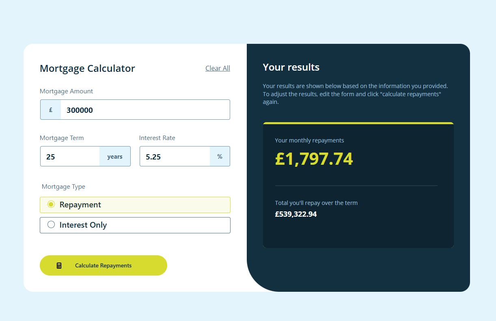
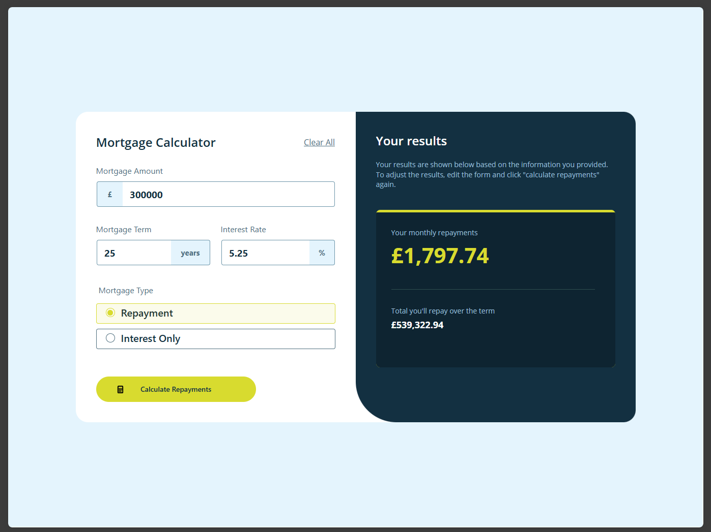
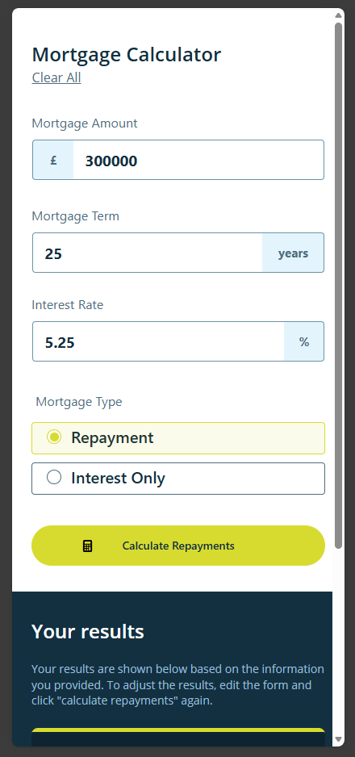
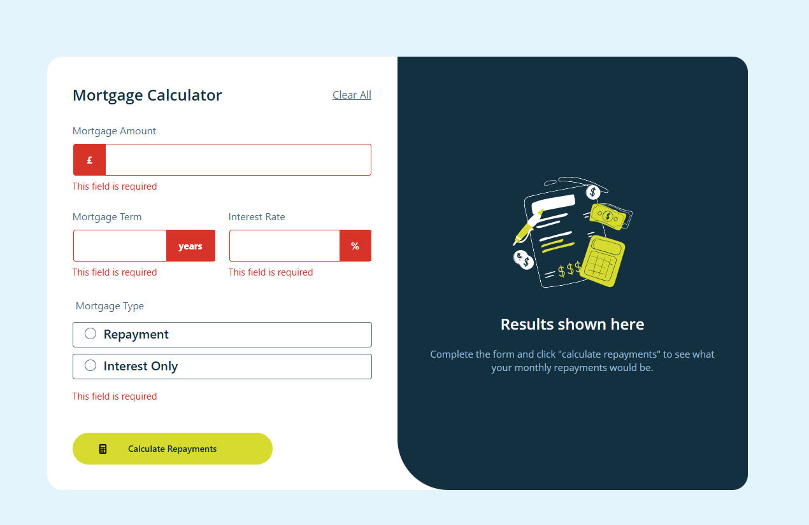
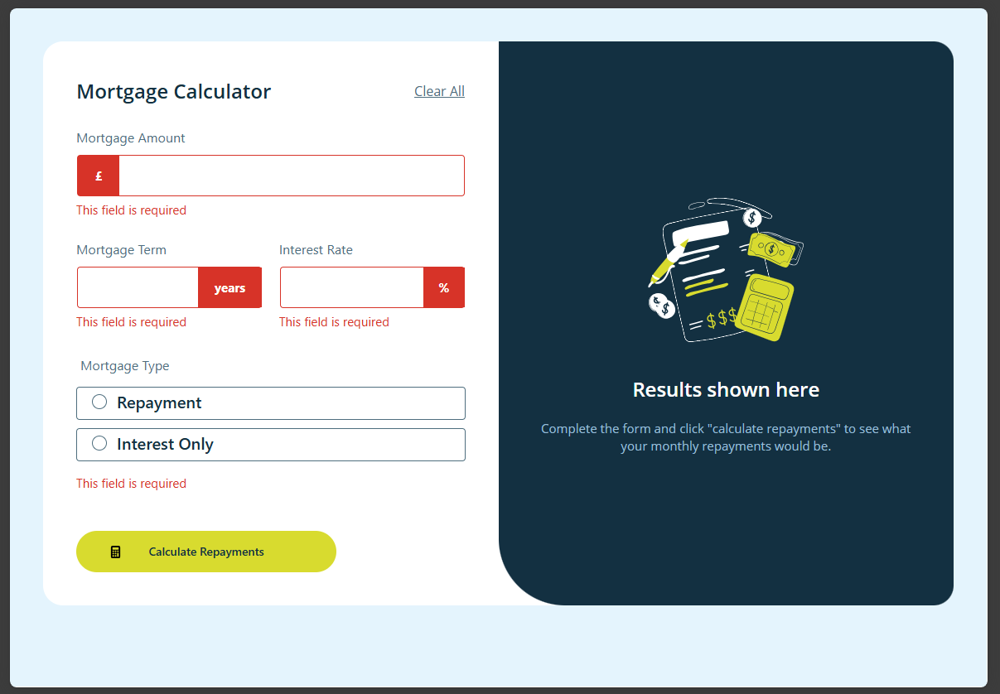
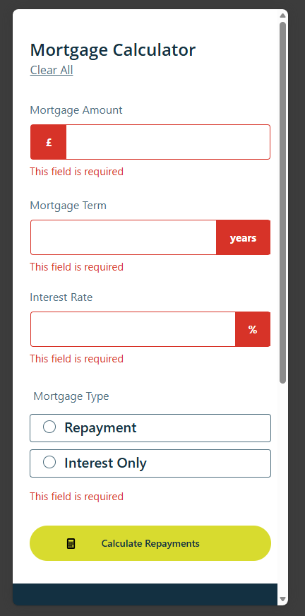

# Frontend Mentor Challenge – Mortgage repayment calculator

Power Apps Canvas application that functions as a mortgage calculator, allowing users to input mortgage details and calculate monthly and total repayment amounts after submitting the form. The application includes form validation to ensure all required fields are completed, supports full keyboard navigation for accessibility, and provides hover and focus states for all interactive elements. It also features a responsive layout that adapts to different screen sizes to ensure optimal usability across desktop, tablet, and mobile devices.

## 🚀 Getting Started

This repository contains the Power Apps Canvas application exported as an `.msapp` file.

### Import the app

1. Go to https://make.powerapps.com
2. Select your **environment**.
3. Open **Apps** from the left navigation.
4. Click **Import canvas app**.
5. Upload the `.msapp` file from this repository.
6. The application will open in **Power Apps Studio**.

After importing, review the app and publish it if needed.

## 🧩 Technologies Used

- Power Apps Canvas
- Microsoft Power Platform
- Responsive layout techniques
- UI logic implemented with Power Fx

---

## 🖼 Screenshots

| Desktop Design | Tablet Design | Phone Design |
|---------------|--------------|--------------|
|  |  |  |
|  |  |  |
---

## 📊 Features

- Calculates monthly mortgage repayment based on user input
- Displays total repayment amount for the full mortgage term
- Form validation with clear messages for incomplete fields
- Fully keyboard accessible form and controls
- Hover and focus states for all interactive elements
- Responsive layout optimized for desktop, tablet, and mobile devices

---

## 🎯 Challenge Source

This project is based on a challenge from Frontend Mentor.  
Frontend Mentor provides real-world front-end challenges that help developers improve their coding and UI skills.

https://www.frontendmentor.io/

---

## ⚠️ Notes

Depending on your environment, you may need to reconfigure data sources or connections after importing the app.

---

## 👨‍💻 Author

Created as part of my learning process and experimentation with building front-end style applications using Power Apps Canvas.

---
